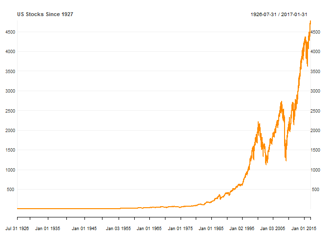
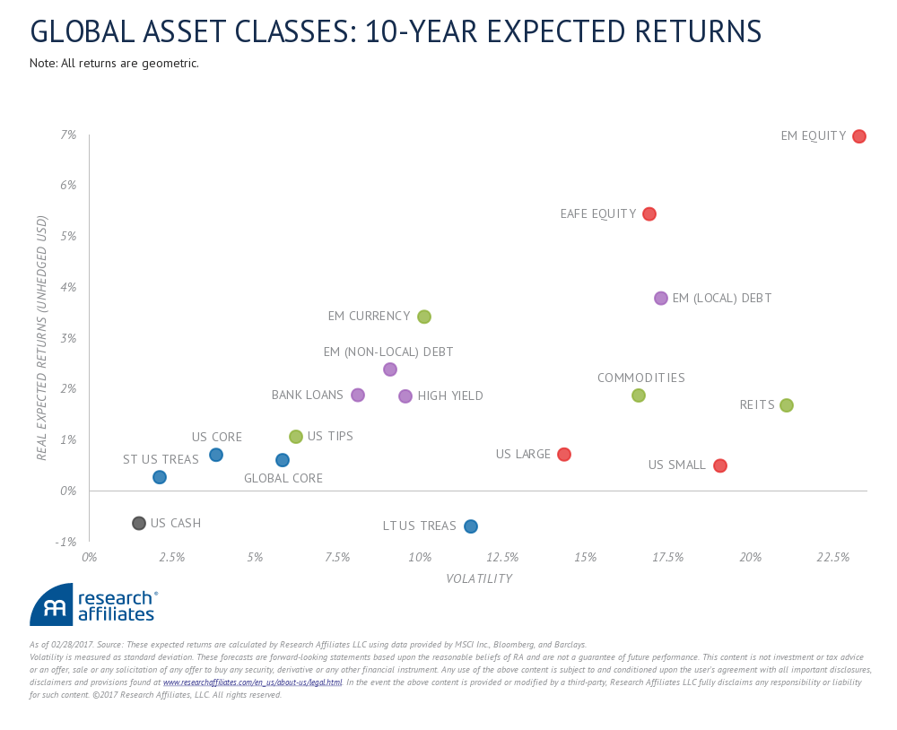
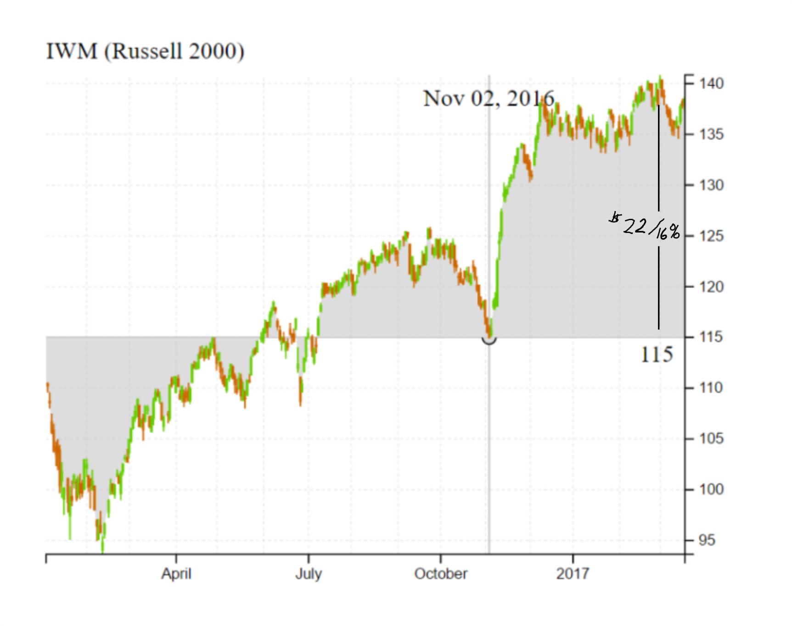
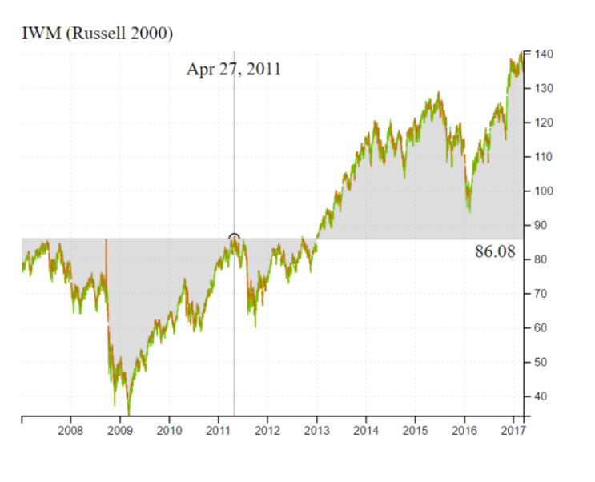

Picking the Top - A Real-time Story
================

Disclaimer
----------

This is not advice, and in no way should be considered advice. In reality, "picking tops" is a horrible idea that leads to the ruin of anyone reckless or arrogant enough to attempt it.

Introduction
------------

I am a money manager who has closely followed markets for over 20 years and diligently studied as much market history as I can. Unfortunately, even with what seems to be an infinite amount of market history, we will never have enough. We will always struggle with uncertainty and risk, and this challenge is what I find so compelling about markets. What history we have suggests equity markets generally go up, and if we limit our history to the anomaly of the United States, equity market compounding almost seems a guarantee. We are taught that passive buying and holding of stocks offers the best route to building wealth. We even learn that buying tops or breakouts in any market can often be a very successful strategy. Fighting history and trying to make money from picking tops in US stocks seems like a foolish effort with a high probability of disastrous ruin.

I have spent nearly the last five years in cash watching the US stock market persistently climb. I have hit an all-time low as stocks post new highs, and I spend my days distracting myself with data visualization, programming, and photography convinced that in aggregate very little real or compelling opportunity exists. This is no way for a money manager to live, so I have even considered other careers. Fortunately, my study of market history is thorough enough to know that this condition is temporary, and I am emboldened by the most unlikely of opportunities--picking the top in US stocks. The simple belief is that US stock prices have climbed to a level that makes future returns very unlikely. Clearly, I am the dumb one at the market poker table.

Biographies and autobiographies suffer from ex-post rationalization, so I will write this in real-time and my efforts will be actual trades with the little bit of money I have. I will author in the open with a version control system called git, which will provide timestamps for each and every commit, so no ex-post silliness can be used to alter or adjust the outcome.

Even Dumber
-----------

While I have the odds and market gods against me, I certainly should not push my luck. Breaking down the US stock market by size suggests that small stocks do best, so it seems the least unlikely bet for a short strategy would be small-cap stocks. However, as you might already have discovered, I am not quite following conventional market wisdom, and I believe the best opportunity for future downside is in this least likely of places. While the chart below from [Research Affiliates, LLC](https://www.researchaffiliates.com/en_us/about-us.html) is certainly not the only reason I hold this belief, I think it summarizes future prospects for US small stocks very well.

Why You (nor I) Should Short?
-----------------------------

-   asymmetry - max down is 0 for individual stocks but with an index even less likely to go to 0. However, there is no limit to how high stocks and indexes can go. Risk is unlimited while return is capped.

-   volatility increases and the ride roughens as your position starts working. Look at other seemingly easy shorts with perfect hindsight, and then consider the pleasantness of the experience. Demonstrate drawdowns in ideal short positions.

-   down moves don't occur from the top. Most down periods are concentrated in sideways to already down-moving markets.

-   betting against human innovation and improvement

-   no fun celebrating while others in misery

Methods of Pursuit
------------------

-   cash and wait

-   inverse ETFs

-   direct shorts

-   **options**

    I will choose these for the attractive asymmetry and non-recourse leverage.

Short and Long Term Potential
-----------------------------

Let's take a conservative look at potential rewards from a short position in IWM, the Russell 2000 ETF. In the short-term, the area must vulnerable is the post-Trump rally. I believe erasing this rally presents a chance for quick profits and assign a much higher chance that the next move will be down 15% than up 15%.

The chart above is daily. A more granular look with an intraday chart more readily demonstrates the vulnerability.

I would not be spending so much time documenting this experience though if this was all that I expected to the downside. Macro vulnerabilities make positive feedback in a negative context likely, and as the market moves down, these vulnerabilities could very easily transform into ugly realities.

Notice that I did not pick 2009 lows as the opportunity. I don't view these lows as unrealistic, but I like to be conservative with my estimates, so I chose the top from Spring 2011. If we look at other equity markets around the world, many have still not exceeded Spring 2011 levels. Spring 2011 provides a very good marker where US stocks moved higher while most of the rest of the world moved sideways to lower.

While the short-term move discussed earlier could very easily occur in one fell swoop, this longer-term move will be choppier and will require very careful trading to ease some of the pain of drawdown from quick, sudden bounces or relief rallies. Since I expect the short-term move to be much easier to exploit, I will concentrate most on
